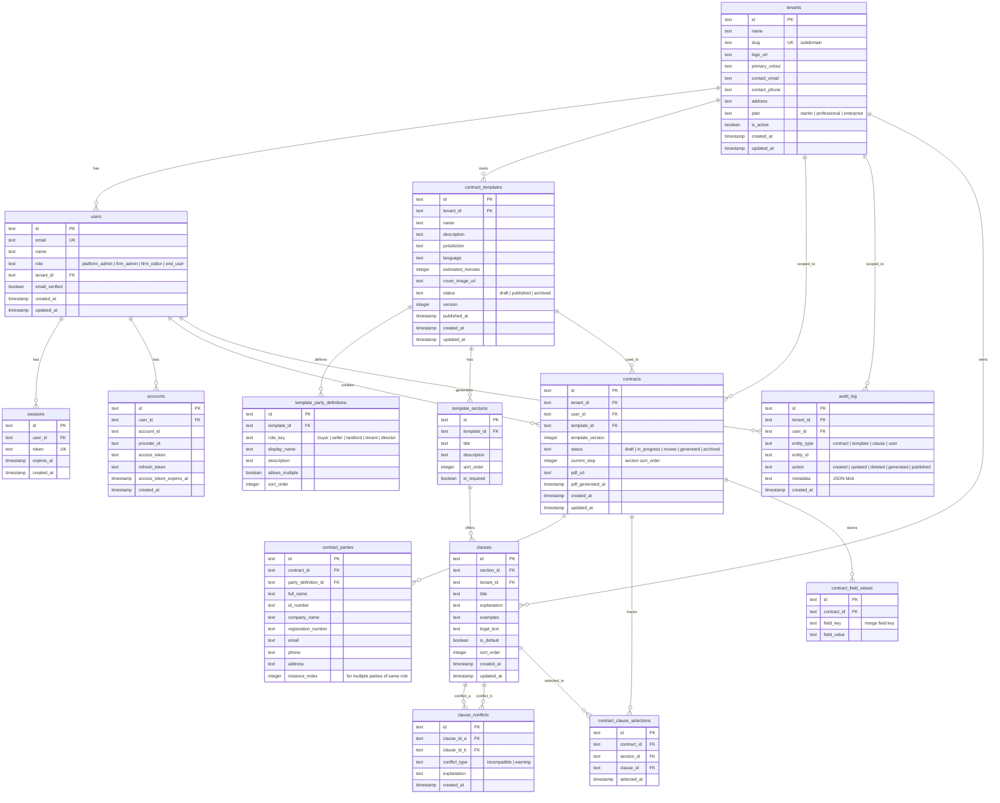

# ERD.md — LegalForge Entity Relationship Diagram

> **Version:** 1.0.0-draft
> **Date:** 2026-06-30
> **Status:** Planning Phase

---

## 1. Overview

The database is a Cloudflare D1 (SQLite) instance managed with Drizzle ORM. All tenant-scoped tables include a `tenant_id` foreign key for row-level isolation. Better Auth manages the `users`, `sessions`, `accounts`, and `verifications` tables.

---

## 2. Entity Relationship Diagram



---

## 3. Table Descriptions

### `tenants`

Each row represents a law firm (or company) subscribing to LegalForge. The `slug` drives subdomain routing. `primary_colour` is used for white-labelling the UI and PDF letterhead.

### `users`

Better Auth-managed user records, extended with `role` and `tenant_id`. The `role` field determines access:

- `platform_admin` — no tenant restriction.
- `firm_admin`, `firm_editor` — scoped to their `tenant_id`.
- `end_user` — scoped to their `tenant_id`.

### `contract_templates`

A template defines the structure of a contract. `version` increments on each publish. In-progress contracts lock to the `template_version` at the time they started.

### `template_party_definitions`

Defines the named parties for a template (e.g., "Buyer", "Seller"). `allows_multiple` enables, for example, multiple shareholders in an agreement.

### `template_sections`

Ordered sections within a template (e.g., "1. Purchase Price", "2. Occupation Date"). `sort_order` controls wizard step order.

### `clauses`

The actual clause text for each section. `is_default` marks the clause pre-selected when the wizard loads a step. `legal_text` is the formal wording; `explanation` is the plain-language guide; `examples` are real-world scenario illustrations.

### `clause_conflicts`

A conflict pair between two clauses. `conflict_type`:

- `incompatible` — selecting both is legally invalid; user must choose one.
- `warning` — selecting both is unusual and the user should be cautioned, but it's not blocked.

### `contracts`

An end user's contract in progress. `status` tracks lifecycle. `current_step` stores which section the user is on for resume-on-reload. `pdf_url` is a signed Cloudflare R2 URL once generated.

### `contract_parties`

The actual party data collected from the user during wizard Step 1. `instance_index` allows multiple parties of the same `role_key` (e.g., three shareholders).

### `contract_clause_selections`

Stores which clause was selected for each section of a specific contract. One row per `(contract_id, section_id)`. On change, the old row is replaced.

### `contract_field_values`

Stores additional free-form field values collected during the wizard (amounts, dates, addresses not tied to parties) for merge field substitution.

### `audit_log`

Immutable event log. `metadata` is a JSON blob with diff details or additional context.

---

## 4. Key Indexes

```sql
-- Tenant isolation (on every tenant-scoped table)
CREATE INDEX idx_contracts_tenant ON contracts(tenant_id);
CREATE INDEX idx_templates_tenant ON contract_templates(tenant_id);
CREATE INDEX idx_clauses_tenant ON clauses(tenant_id);

-- Common queries
CREATE INDEX idx_contracts_user ON contracts(user_id);
CREATE INDEX idx_contracts_status ON contracts(tenant_id, status);
CREATE INDEX idx_sections_template ON template_sections(template_id, sort_order);
CREATE INDEX idx_clauses_section ON clauses(section_id, sort_order);
CREATE INDEX idx_conflicts_clause_a ON clause_conflicts(clause_id_a);
CREATE INDEX idx_conflicts_clause_b ON clause_conflicts(clause_id_b);
CREATE INDEX idx_selections_contract ON contract_clause_selections(contract_id);
CREATE INDEX idx_audit_entity ON audit_log(entity_type, entity_id);
```

---

## 5. Conflict Detection Query

When a user selects `clause_id = X` in the wizard, the system checks:

```sql
SELECT
    cc.*,
    c.title AS conflicting_clause_title,
    c.explanation AS conflicting_clause_explanation
FROM clause_conflicts cc
JOIN clauses c ON (
    (cc.clause_id_a = :selectedClauseId AND c.id = cc.clause_id_b)
    OR
    (cc.clause_id_b = :selectedClauseId AND c.id = cc.clause_id_a)
)
WHERE (cc.clause_id_a = :selectedClauseId OR cc.clause_id_b = :selectedClauseId)
  AND c.id IN (
      -- previously selected clauses for this contract
      SELECT clause_id FROM contract_clause_selections
      WHERE contract_id = :contractId
  );
```

---

## 6. Merge Field Substitution

Merge fields in `clauses.legal_text` follow the `{{scope.fieldName}}` pattern:

| Token                        | Resolved From                                                           |
| ---------------------------- | ----------------------------------------------------------------------- |
| `{{buyer.fullName}}`         | `contract_parties.full_name` where `role_key = 'buyer'`                 |
| `{{seller.idNumber}}`        | `contract_parties.id_number` where `role_key = 'seller'`                |
| `{{contract.purchasePrice}}` | `contract_field_values.field_value` where `field_key = 'purchasePrice'` |
| `{{contract.date}}`          | `contracts.created_at` (formatted)                                      |
| `{{firm.name}}`              | `tenants.name`                                                          |

The merge field substitution engine runs server-side at PDF generation time, replacing all tokens with resolved values or flagging missing values.
